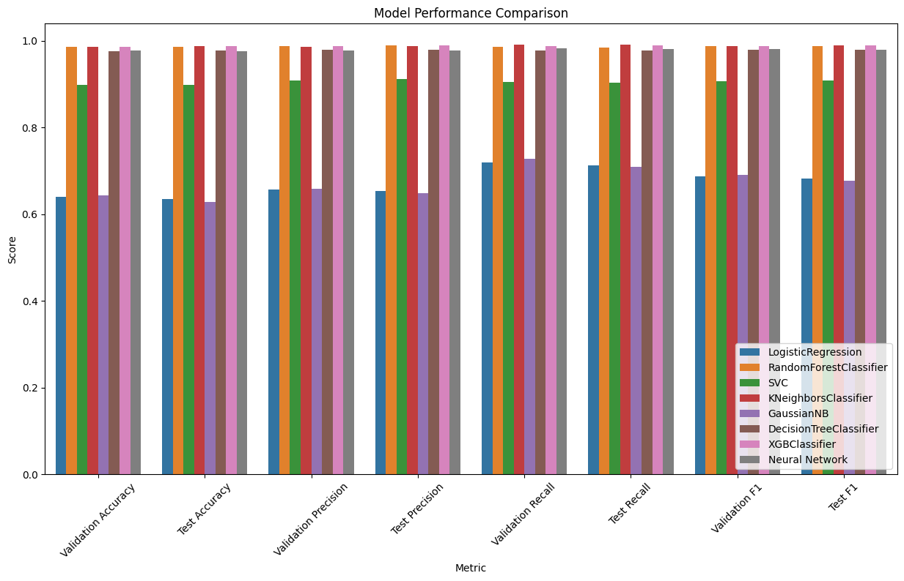

# Mushroom Classification Project

This project aims to classify mushrooms as either edible or poisonous based on various features using different machine learning algorithms and a simple neural network.

## Dataset

The dataset used in this project is originally from the [UCI Machine Learning Repository](https://archive.ics.uci.edu/dataset/848/secondary+mushroom+dataset) but i will be using a cleaned version of it. It can be accessed from [Kaggle](https://www.kaggle.com/datasets/prishasawhney/mushroom-dataset).
You can access the code through the [Google Colab](https://colab.research.google.com/drive/1mY1Y4Az57nuF3pTPRh8cF2z45ZE5gkeY?usp=sharing) or [Kaggle]().

**Features**

- `cap-diameter`: Diameter of the mushroom cap in mm.
- `cap-shape`: Shape of the mushroom cap (encoded).
- `gill-attachment`: Type of gill attachment (encoded).
- `gill-color`: Color of the gill (encoded).
- `stem-height`: Height of the mushroom stem in cm.
- `stem-width`: Width of the mushroom stem in mm.
- `stem-color`: Color of the mushroom stem (encoded).
- `season`: Season the mushroom was found (encoded).

**Target Variable**

- `class`: Edibility of the mushroom (0 = poisonous, 1 = edible).

**Models Used**

The project evaluates the following machine learning models:

- Logistic Regression
- Random Forest Classifier
- Support Vector Machine (SVM)
- K-Nearest Neighbors (KNN)
- Gaussian Naive Bayes
- Decision Tree Classifier
- XGBoost Classifier
- A simple neural network model

**Files**

- `mushrooms_cleaned.csv`: Preprocessed dataset after cleaning and feature engineering.
- `mushroom_classification.ipynb`: Jupyter Notebook containing the code for data loading, preprocessing, model training, evaluation, and comparison.
- `README.md`: This file, providing an overview of the project.
- `output.png`: The graph that show the comparison of the models.

**Requirements**

The project requires the following Python libraries:

- NumPy
- Pandas
- Matplotlib
- Scikit-learn
- TensorFlow/Keras
- XGBoost

You can install the required libraries using the following command:

```
pip install numpy pandas matplotlib scikit-learn tensorflow xgboost
```

## Usage

 1. Clone the repository:
    ```
    git clone https://github.com/UfukTanriverdi8/mushroom-classification.git
    cd mushroom-classification
    ```

    Run the Jupyter Notebook for **mushroom_classification.ipynb**:

    ```
    jupyter notebook mushroom_classification.ipynb
    ```
    **OR**

    Just run the notebook from the [Colab link](https://colab.research.google.com/drive/1mY1Y4Az57nuF3pTPRh8cF2z45ZE5gkeY?usp=sharing).

 3. Follow the instructions in the notebook to execute each cell and run the project.

## Results

- The project evaluates each model's performance using accuracy, precision, recall, and F1-score metrics.


- Logistic Regression and Gaussian Naive Bayes models performed poorly compared to the other models.
- Except for these two models, the others achieved high metrics overall. The Random Forest Classifier was the best-performing model, but K-Neighbors Classifier, XGB Classifier, Decision Tree Classifier, and the neural network model also had metrics close to those of the Random Forest Classifier.
- The validation and test metrics are very close to each other, indicating that we successfully prevented overfitting.
- With some parameter tuning, the performance of the underperforming models could be improved.
- Based on performance, Random Forest Classifier, Decision Tree Classifier, and XGB Classifier are highly recommended for this dataset. Additionally, the neural network model shows promise with further parameter tuning.